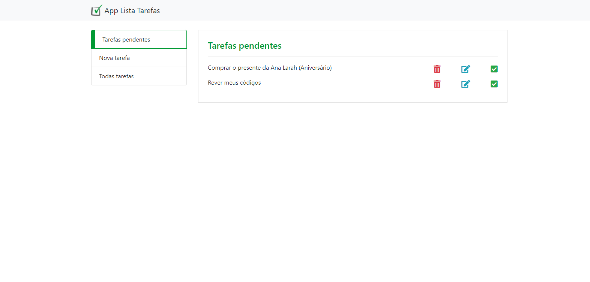
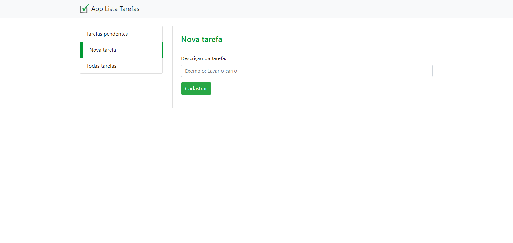
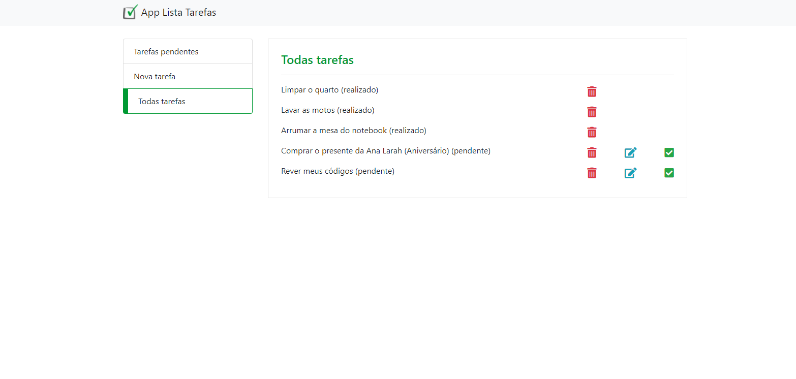

# App Lista Tarefas

## Sobre o App Lista Tarefas
<p>
  É uma app web desenvolvido no período em que estava realizando o curso <strong>Desenvolvimento Web Completo 2022 - 20 cursos + 20 projetos</strong> criado por 
  Jorge Sant Ana e Jamilton Damasceno na Udemy. 
</p>
<p>
O app possibilita adicionar, atualizar e remover tarefas, criando assim uma lista de tarefas onde se tem a possibilidade também de marcá-las como concluídas ou
 deixar como pendente.
</p>

## Layout web
### Tela inicial


### Tela para criar uma nova tarefa


### Tela para visualizar todas as tarefas


## Tecnologias utilizadas
<p>Linguagens e padrões que foram utilizadas para desenvolver o app.</p>

## Front-end
- HTML / CSS / JS
- Bootstrap 

### Back-end
- PHP
- MySQL

### Competências 
- Programação orientadas a objetos
- Prevenção contra SQL Injection

## Como executar o projeto

Instruções para executar o app

## Back-end
Pré-requisitos: Servidor Apache (XAMPP)

Clonar repositório

```bash
  https://github.com/othonss/Projeto-tarefas 
```
Copiar para dentro da pasta htdocs (caso XAMPP)

Copiar estrutura (banco_de_dados.sql) da pasta sql_tabelas


## Front-end
Pré-requisitos: Navegador  

Acessar o localhost indicando o diretório aonde foi copiado 

Exemplo: 
```bash
  http://localhost/app_lista_tarefas_public/index.php
```

## Autor 

Othon Santos da Silva

<a href="https://www.linkedin.com/in/othon-santos-35531b129/" target="_blank">
    
 </a>
 
